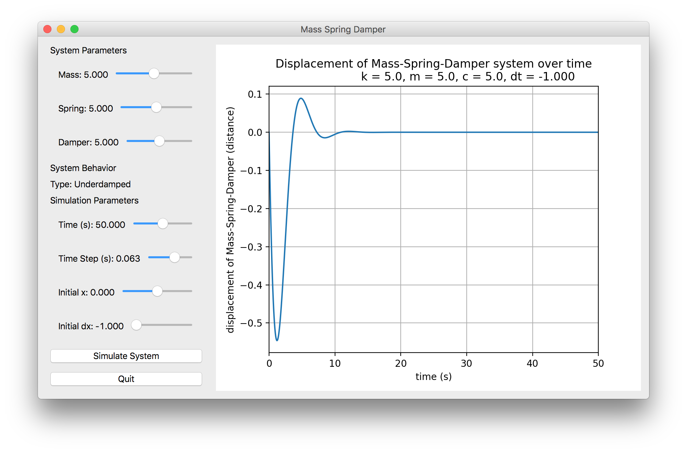

# gui-for-graphing-float-slider-values-in-pyqt5

## Reading the code
The entry point to (or beginning of) the program is at the bottom of slider2.py and it is only 4 simple lines:

    app = QApplication([])
    gui = Grapher()
    gui.show()
    app.exec_()

- `QApplication()` comes from the package PyQt5  
- `Grapher()` is our "main" gui `QMainWindow` utilizing PyQt5 widgets. 

Attention should be paid to `Grapher.__init__()` which houses the main GUI code (generating the sidebar using sub classes, getting values from sliders, creating the graph, etc.). Additionally, DoubleSlider() which has been modified from code shared by user jdreaver as 'double_slider.py' on github as of March 2019.

## Python Packages: how to install and utilize `PyQt5` and `matplotlib`
`PyQt5` is the gui package used in this program. A package (or "module") is imported in python before running the program. `pip` can be run from the command line (highly reccomend installing it!) to install the packages used in this program (namely, `PyQt5` and `matplotlib`)

In python code we sometimes use a custom local name because it's shorter and easier. For example `local_name` in the following code:

    import package.function as local_name

Here is an example from slider2.py:

    import matplotlib.pyplot as plt

We use this shortened name `plt` in our code to plot a list of x and y values:

    plt.plot(xs, ys)

The `matplotlib` backend, `qt5agg`, allows us to attach a plot to a `QWidget` as a widget (ie. it basically converts a matplotlib figure to a QWidget). Specifically, we have some snippet of code from `slider2.py` showing the FigureCanvas graph being added to the Qt layout of the gui:
    
    # make a "main" widget
    widget = QWidget()
    self.setCentralWidget(widget)
    
    # figure for graph to be placed
    self.figure = Figure()
    self.display = FigureCanvas(self.figure)
    
    # the layout of the widget
    top_level_layout = QHBoxLayout()
    widget.setLayout(top_level_layout)

## Executing The Code
To execute the python gui in slider2.py, run with python using the command: 

    python3 slider2.py

or run it as an executable with the command:

    ./slider2.py

after first changing permissions of the slider2.py file to now be an executable with `chmod` using the command:

    chmod +x slider2.py

## The GUI
- The GUI will **create graphs of a mass-spring-damper system**'s one-dimensional position as a function of time from the output of a system simulator `MassSpringDamper.simulate()`.

- The MSD simulator uses **floating point slider values** eg. damping ratio, time increment, etc. from modified QSlider() widgets. The slider labels are updated automatically when moved by the user. 